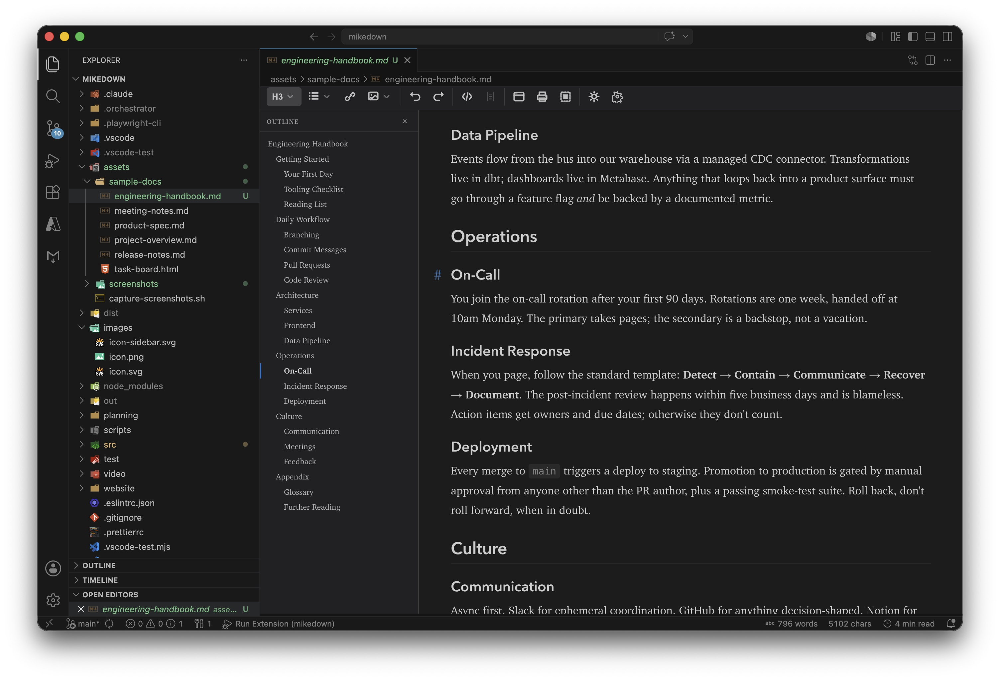

# MikeDown Editor

**A true WYSIWYG Markdown editor for VS Code — edit markdown visually, right in your editor tabs.**


## Why MikeDown?

The split-pane markdown preview workflow gets old fast — source on one side, rendered output on the other, constantly switching between the two. Standalone markdown editors solve the editing experience but pull you out of VS Code, away from Git integration, multi-language file support, and the extensions you already rely on.

MikeDown closes that gap. It's an open-source WYSIWYG Markdown editor that lives entirely inside VS Code. Open multiple markdown files across panes, windows, and monitors — all without leaving your editor.

## Enjoying MikeDown?

If this free extension is making your markdown workflow better, please **tell a friend or co-worker** or **[leave a review on the VS Code Marketplace](https://marketplace.visualstudio.com/items?itemName=interapp.mikedown-editor&ssr=false#review-details)**. Ratings and word of mouth are what get the word out — it genuinely helps.

## Screenshots

*New in 2.0 — an in-editor document outline pane that follows your cursor and scroll position. Click any heading to jump there:*



*Multiple markdown documents open side by side, each with full WYSIWYG editing:*


*Markdown editing alongside code — no separate app, no context switching:*


## Features

### Document Outline *(new in 2.0)*

Click the small `≡` icon in the top-left of any MikeDown tab to reveal a compact, per-document outline. The active section follows both your cursor *and* the scroll position — so jumping via an in-document anchor link keeps the outline in sync. Click any heading to jump straight to it. Drag the right edge to resize (160–360px). Hidden by default; control with **Always show / Always hide / Remember per document** in the in-editor settings modal or via `mikedown.outline.visibility`.

### True WYSIWYG Editing

Edit markdown visually using a TipTap/ProseMirror-based editor. What you see is what you get — headings render as headings, lists render as lists, and you never have to look at raw syntax unless you want to.

*WYSIWYG editing in light mode -- task lists, headings, and formatted text rendered live:*


### Source Mode Toggle

Press `Cmd+/` (Mac) or `Ctrl+/` (Windows/Linux) to instantly switch between WYSIWYG and raw markdown. Useful for fine-tuning syntax or pasting raw content.

*Source mode showing raw markdown with the toolbar still accessible:*


### Apple Notes-Style Toolbar

A condensed toolbar with dropdown menus for formatting, insert, and export actions. Clean and out of the way until you need it.

*Toolbar dropdown for inserting lists, blockquotes, and code blocks:*


### Smart Paste

Paste content from Google Docs, Microsoft Word, Slack, web pages, and other rich-text sources. MikeDown converts it to clean markdown automatically.

### GitHub Flavored Markdown

Full GFM support including tables, task lists, strikethrough, and fenced code blocks.

### Highlight *(new in 2.3)*

Surround text with `==…==` to mark it with a yellow highlight, like a paper highlighter pen. Available from the toolbar (highlighter icon), right-click → **Highlight**, or **Cmd+Shift+H** / **Ctrl+Shift+H**. Round-trips to `==text==` in the saved markdown so GitHub renders it the same way.

<!-- TODO: screenshot of highlighted text in editor -->

### Emoji *(new in 2.3)*

Type `:smi` and an autocomplete popup shows matching shortcodes — Enter inserts. The full GitHub shortcode set is supported (`:tada:`, `:rocket:`, `:eyes:`, etc.). Click the smiley icon on the toolbar (or **Cmd+;** / **Ctrl+;**, or right-click → **Insert Emoji…**) for a searchable picker with category sections and recently-used emoji.

<!-- TODO: screenshot of emoji picker / autocomplete -->

### Callouts / Admonitions *(new in 2.1)*

GitHub-style alert blocks render as styled, icon-prefixed panels. Five kinds are recognized: `[!NOTE]`, `[!TIP]`, `[!IMPORTANT]`, `[!WARNING]`, `[!CAUTION]`.

```markdown
> [!WARNING]
> This action cannot be undone.
> Make sure you have a backup first.
```

Insert one from the toolbar **Lists & Blocks** dropdown (or right-click → **Callout**) — the five kinds are exposed as a row of color-coded badges so you don't have to remember the marker syntax. Toggling between kinds is one click, and saving writes the canonical `> [!KIND]` GFM source back to disk.

### Link Navigation and Autocomplete

- **Cmd+Click** (or Ctrl+Click) to follow links to files, headings, or URLs
- **Right-click** any link for Open Link / Open Link in New Tab options
- **Link autocomplete**: start typing a link and get fuzzy-matched suggestions from workspace files and headings

*Right-click context menu with formatting, link, and insert options:*


### Broken Link Detection

Links pointing to missing files or nonexistent headings get a red wavy underline, so you catch broken references before your readers do.

### Backlink Explorer

A sidebar panel in the Explorer view that shows which files in your workspace link to the current document. Useful for wiki-style note collections and documentation projects.

### Table Editing

Insert tables with a grid picker, edit with a contextual toolbar, drag handles for reordering rows and columns, and multi-cell selection support.

### Find and Replace

Full find-and-replace inside the WYSIWYG editor. Most WYSIWYG markdown editors skip this — MikeDown does not.

### Code Block Syntax Highlighting

192 languages supported via lowlight/highlight.js. Code blocks render with proper syntax coloring in the editor. Hover any code block to reveal a **Copy** button in the top-right corner — one click copies the block's contents to your clipboard.

### Frontmatter Support

YAML frontmatter blocks display as a collapsible section above the editor content. Edit metadata without switching to source mode.

### Editor-Only Theme Toggle

Switch between light and dark mode inside MikeDown editor tabs without changing VS Code's global theme. Handy when you want a light writing surface but a dark IDE.

### Export and Share

- Export as HTML
- Print / Export as PDF
- Copy as rich text (paste into Docs, Slack, email)

### Image Support

Images render inline. Click an image to access an edit popover for adjusting source, alt text, and title. Paste a screenshot (Cmd/Ctrl+V) or drag an image file into the editor to save it to a sibling `images/` folder and insert the markdown link automatically — destination, filename pattern, path style, and alt-text behavior are all configurable via `mikedown.imagePaste.*` settings.

Right-click an image to access **Resize 75% / 50% / 25%** presets — handy for halving Mac high-DPI screenshots that come in at 2× physical size. By default the resize overwrites the original file in place; flip `mikedown.imageResize.overwrite` to write a sibling like `foo-50pct.png` and update the link instead.

When you save, MikeDown also cleans up unreferenced images. To keep this safe, three conditions must all hold before a file is deleted: it must live inside the configured `imagePaste.folder`, it must look like a MikeDown-generated paste (the filename matches the configured `filenamePattern` shape — so user-curated assets like `logo.png` or `hero-banner.png` are never touched), and no other markdown file in the workspace can reference it. Disable with `mikedown.imagePaste.cleanupUnreferenced` if you'd rather manage the folder yourself.

## Getting Started

### Install

Install **MikeDown Editor** from the [VS Code Marketplace](https://marketplace.visualstudio.com/items?itemName=interapp.mikedown-editor), or search for "MikeDown" in the VS Code Extensions panel and click Install.

### Open your first file

1. Open any `.md` or `.markdown` file in VS Code.
2. Right-click the file in the Explorer (or right-click the editor tab) and choose **Open with MikeDown**. You can also open the Command Palette (`Cmd+Shift+P` / `Ctrl+Shift+P`) and run **Open with MikeDown**.
3. The file opens in WYSIWYG mode. Start editing — your changes are saved back to the original markdown file, just like a normal text editor.
4. Press `Cmd+/` (Mac) or `Ctrl+/` (Windows/Linux) any time to flip between WYSIWYG and raw markdown source.

### Make MikeDown the default editor for markdown files in VS Code

By default, VS Code opens `.md` files in its standard text editor. To have MikeDown open them automatically:

1. Open VS Code Settings (`Cmd+,` / `Ctrl+,`).
2. Search for `mikedown.defaultEditor`.
3. Enable the checkbox.

Now every `.md` or `.markdown` file you open in VS Code will go straight into MikeDown's WYSIWYG view. The raw source is always one keystroke away with `Cmd+/`.

### Open `.md` files in VS Code from Finder or File Explorer

If you want double-clicking a `.md` file in your OS file manager to launch it in VS Code (and therefore in MikeDown, once you've enabled the setting above):

**macOS**

1. In Finder, right-click any `.md` file and choose **Get Info**.
2. Expand the **Open with** section and pick **Visual Studio Code** from the dropdown. If it's not listed, choose **Other...** and select VS Code from `/Applications`.
3. Click **Change All...** and confirm. Every `.md` file will now open in VS Code by default.

**Windows**

1. In File Explorer, right-click any `.md` file and choose **Open with → Choose another app**.
2. Pick **Visual Studio Code** from the list. If it's not shown, click **More apps**, scroll down, or use **Look for another app on this PC** and select `Code.exe`.
3. Check **Always use this app to open .md files** before clicking OK.

## Keyboard Shortcuts

All shortcuts are active when a MikeDown editor tab is focused.

| Action | Mac | Windows / Linux |
|---|---|---|
| Toggle Bold | `Cmd+B` | `Ctrl+B` |
| Toggle Italic | `Cmd+I` | `Ctrl+I` |
| Toggle Strikethrough | `Cmd+Shift+S` | `Ctrl+Shift+S` |
| Toggle Inline Code | `Cmd+Shift+K` | `Ctrl+Shift+K` |
| Toggle Source Mode | `Cmd+/` | `Ctrl+/` |
| Undo | `Cmd+Z` | `Ctrl+Z` |
| Redo | `Cmd+Shift+Z` | `Ctrl+Shift+Z` |

## Settings

MikeDown exposes the following settings under `mikedown.*` in VS Code's Settings UI:

| Setting | Default | Description |
|---|---|---|
| `mikedown.defaultEditor` | `false` | Open `.md` files in MikeDown by default |
| `mikedown.fontFamily` | (system sans-serif) | Font family for the editing area |
| `mikedown.fontSize` | `15` | Font size in pixels (10--36) |
| `mikedown.linkClickBehavior` | `openNewTab` | What Cmd+Click does on links: navigate in current tab, open new tab, or show context menu |
| `mikedown.themeToggleScope` | `editorOnly` | Whether the theme toggle affects only MikeDown or VS Code globally |
| `mikedown.editorTheme` | `auto` | Override theme for MikeDown tabs: auto, light, or dark |
| `mikedown.autoReloadUnmodifiedFiles` | `true` | Auto-reload when external changes are detected |
| `mikedown.markdownNormalization` | `preserve` | Normalize markdown syntax on save, or preserve original style |
| `mikedown.normalizationStyle.boldMarker` | `**` | Bold marker when normalization is enabled |
| `mikedown.normalizationStyle.italicMarker` | `*` | Italic marker when normalization is enabled |
| `mikedown.normalizationStyle.listMarker` | `-` | Unordered list marker when normalization is enabled |
| `mikedown.normalizationStyle.headingStyle` | `atx` | Heading style when normalization is enabled: `atx` (`# Heading`) or `setext` (underline) |
| `mikedown.imagePaste.enabled` | `true` | Save pasted/dropped images automatically. Disable to fall back to VS Code's default paste behavior |
| `mikedown.imagePaste.folder` | `images` | Folder name (or relative path) where pasted images are saved; auto-created |
| `mikedown.imagePaste.folderRelativeTo` | `document` | Resolve `folder` relative to the document directory or the workspace root |
| `mikedown.imagePaste.filenamePattern` | `${docName}-${timestamp}` | Pattern with tokens `${docName}`, `${date}`, `${time}`, `${timestamp}`, `${hash}` (8-char SHA-1, enables dedupe), `${index}` |
| `mikedown.imagePaste.pathStyle` | `relative` | Insert path relative to the document, or workspace-absolute (leading `/`) |
| `mikedown.imagePaste.altText` | `empty` | Alt text source: `empty`, `filename`, or `prompt` (asks on each paste) |
| `mikedown.imagePaste.maxSizeMB` | `10` | Reject pastes larger than this (1--200) |
| `mikedown.imagePaste.cleanupUnreferenced` | `true` | Delete unreferenced images on save (only inside the configured `imagePaste.folder` and only when no other markdown file references them) |
| `mikedown.imageResize.overwrite` | `true` | When resizing from the image popover, overwrite the original file. When `false`, write a sibling like `foo-50pct.png` and update the markdown link |

## Requirements

- VS Code 1.109.0 or later

## Known Limitations

- Complex nested markdown structures may not round-trip perfectly in all cases
- Very large files (10,000+ lines) may have slower initial load times
- Some VS Code extensions that modify markdown files may conflict with the custom editor

## Contributing

MikeDown is open source under the [MIT License](LICENSE.md). Bug reports, feature requests, and contributions are welcome on [GitHub](https://github.com/mikejoseph23/mikedown).

## License

[MIT](LICENSE.md)
