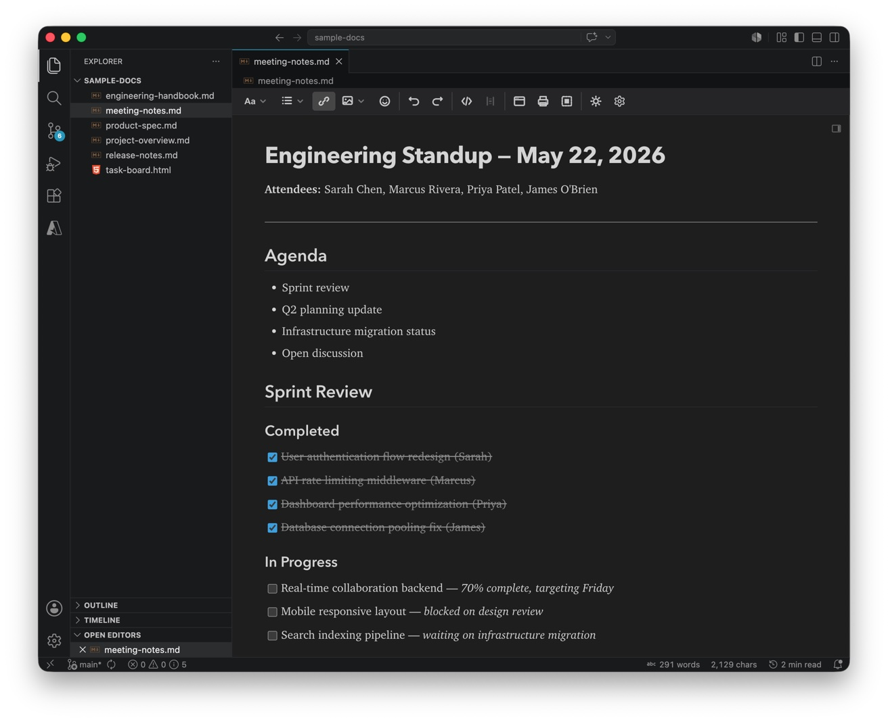
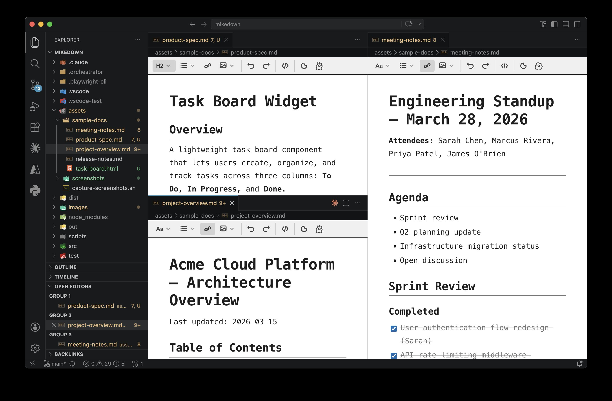
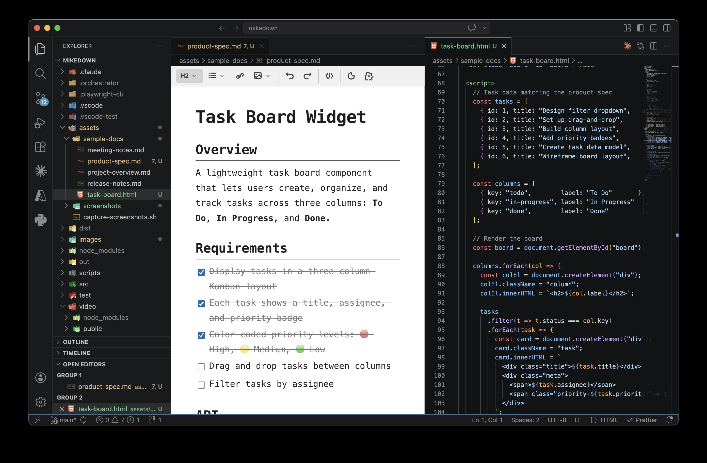
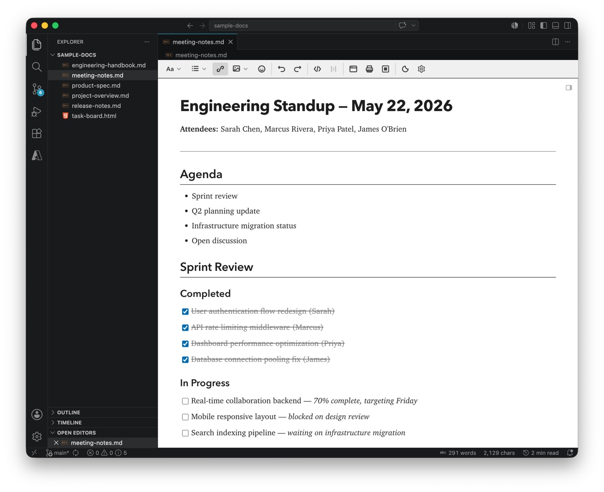
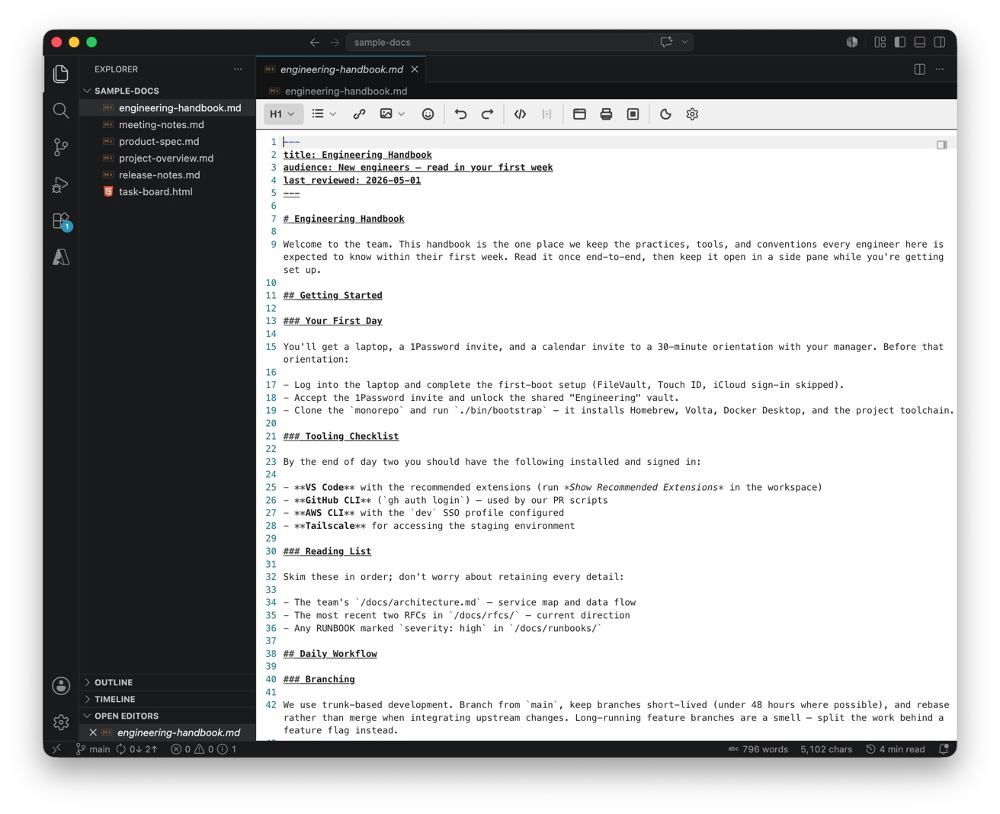
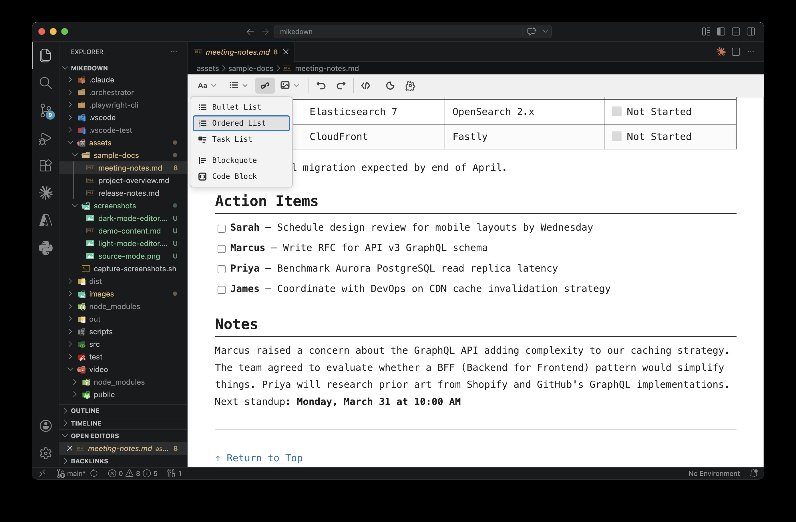
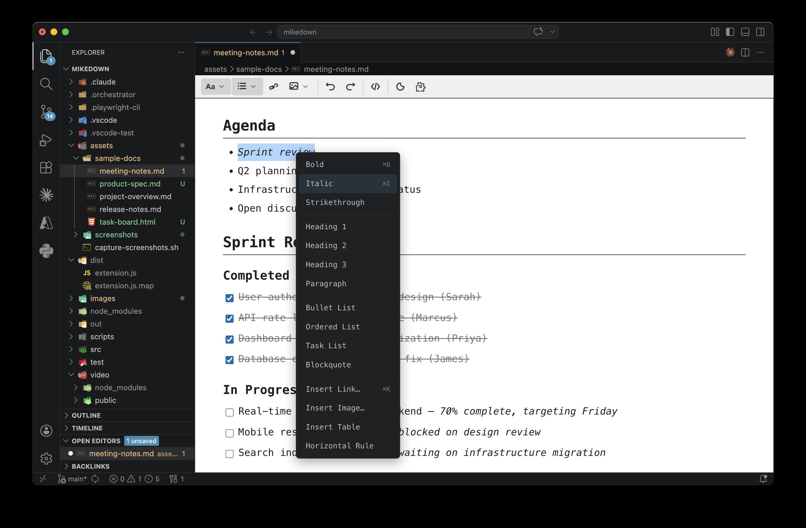

# MikeDown Editor

**A true WYSIWYG Markdown editor for VS Code.**

> **Beta** -- MikeDown Editor is under active development. It is usable today but expect rough edges. Bug reports and feedback are welcome on [GitHub](https://github.com/mikejoseph23/mikedown).

## Why MikeDown?

Hi, I'm Mike — the creator of MikeDown, for lack of a better name. As pretty much the sole user of this extension, the name works for now.

For years I relied on [Markdown Preview Enhanced](https://marketplace.visualstudio.com/items?itemName=shd101wyy.markdown-preview-enhanced) -- source on one side, rendered preview on the other. It works, but the split-pane workflow gets cumbersome fast, especially when you have several markdown files open at once. There are some excellent standalone markdown editors out there, but using a separate app means giving up Git integration, multi-language file support, and the entire VS Code extensions ecosystem.

MikeDown exists to close that gap. It is an open-source, MIT-licensed WYSIWYG Markdown editor that lives entirely inside VS Code -- so you can have multiple markdown files open across panes, windows, and monitors, all without leaving the editor you already use for everything else.

*Multiple markdown documents open side by side, each with full WYSIWYG editing:*

*Markdown editing alongside code -- no separate app, no context switching:*

## Features

### True WYSIWYG Editing

Edit markdown visually using a TipTap/ProseMirror-based editor. What you see is what you get -- headings render as headings, lists render as lists, and you never have to look at raw syntax unless you want to.

*WYSIWYG editing in light mode -- task lists, headings, and formatted text rendered live:*

### Source Mode Toggle

Press `Cmd+/` (Mac) or `Ctrl+/` (Windows/Linux) to instantly switch between WYSIWYG and raw markdown. Useful for fine-tuning syntax or pasting raw content.

*Source mode showing raw markdown with the toolbar still accessible:*

### Apple Notes-Style Toolbar

A condensed toolbar with dropdown menus for formatting, insert, and export actions. Clean and out of the way until you need it.

*Toolbar dropdown for inserting lists, blockquotes, and code blocks:*

### Smart Paste

Paste content from Google Docs, Microsoft Word, Slack, web pages, and other rich-text sources. MikeDown converts it to clean markdown automatically.

### GitHub Flavored Markdown

Full GFM support including tables, task lists, strikethrough, and fenced code blocks.

### Link Navigation and Autocomplete

- **Cmd+Click** (or Ctrl+Click) to follow links to files, headings, or URLs
- **Right-click** any link for Open Link / Open Link in New Tab options
- **Link autocomplete**: start typing a link and get fuzzy-matched suggestions from workspace files and headings

*Right-click context menu with formatting, link, and insert options:*

### Broken Link Detection

Links pointing to missing files or nonexistent headings get a red wavy underline, so you catch broken references before your readers do.

### Backlink Explorer

A sidebar panel in the Explorer view that shows which files in your workspace link to the current document. Useful for wiki-style note collections and documentation projects.

### Table Editing

Insert tables with a grid picker, edit with a contextual toolbar, drag handles for reordering rows and columns, and multi-cell selection support.

### Find and Replace

Full find-and-replace inside the WYSIWYG editor. Most WYSIWYG markdown editors skip this -- MikeDown does not.

### Code Block Syntax Highlighting

192 languages supported via lowlight/highlight.js. Code blocks render with proper syntax coloring in the editor.

### Frontmatter Support

YAML frontmatter blocks display as a collapsible section above the editor content. Edit metadata without switching to source mode.

### Editor-Only Theme Toggle

Switch between light and dark mode inside MikeDown editor tabs without changing VS Code's global theme. Handy when you want a light writing surface but a dark IDE.

### Export and Share

- Export as HTML
- Print / Export as PDF
- Copy as rich text (paste into Docs, Slack, email)

### Image Support

Images render inline. Click an image to access an edit popover for adjusting source, alt text, and title.

## Getting Started

1. Install **MikeDown Editor** from the [VS Code Marketplace](https://marketplace.visualstudio.com/items?itemName=interapp.mikedown-editor).
2. Open any `.md` or `.markdown` file.
3. Right-click the file in the Explorer or editor tab and choose **Open with MikeDown**, or run the command `Open with MikeDown` from the Command Palette.
4. To make MikeDown the default editor for all markdown files, enable `mikedown.defaultEditor` in Settings.

## Keyboard Shortcuts

All shortcuts are active when a MikeDown editor tab is focused.

| Action | Mac | Windows / Linux |
|---|---|---|
| Toggle Bold | `Cmd+B` | `Ctrl+B` |
| Toggle Italic | `Cmd+I` | `Ctrl+I` |
| Toggle Strikethrough | `Cmd+Shift+S` | `Ctrl+Shift+S` |
| Toggle Inline Code | `Cmd+Shift+K` | `Ctrl+Shift+K` |
| Toggle Source Mode | `Cmd+/` | `Ctrl+/` |
| Undo | `Cmd+Z` | `Ctrl+Z` |
| Redo | `Cmd+Shift+Z` | `Ctrl+Shift+Z` |

## Settings

MikeDown exposes the following settings under `mikedown.*` in VS Code's Settings UI:

| Setting | Default | Description |
|---|---|---|
| `mikedown.defaultEditor` | `false` | Open `.md` files in MikeDown by default |
| `mikedown.fontFamily` | (system sans-serif) | Font family for the editing area |
| `mikedown.fontSize` | `15` | Font size in pixels (10--36) |
| `mikedown.linkClickBehavior` | `openNewTab` | What Cmd+Click does on links: navigate in current tab, open new tab, or show context menu |
| `mikedown.themeToggleScope` | `editorOnly` | Whether the theme toggle affects only MikeDown or VS Code globally |
| `mikedown.editorTheme` | `auto` | Override theme for MikeDown tabs: auto, light, or dark |
| `mikedown.autoReloadUnmodifiedFiles` | `true` | Auto-reload when external changes are detected |
| `mikedown.markdownNormalization` | `preserve` | Normalize markdown syntax on save, or preserve original style |
| `mikedown.normalizationStyle.boldMarker` | `**` | Bold marker when normalization is enabled |
| `mikedown.normalizationStyle.italicMarker` | `*` | Italic marker when normalization is enabled |
| `mikedown.normalizationStyle.listMarker` | `-` | Unordered list marker when normalization is enabled |
| `mikedown.normalizationStyle.headingStyle` | `atx` | Heading style when normalization is enabled: `atx` (`# Heading`) or `setext` (underline) |

## Requirements

- VS Code 1.109.0 or later

## Known Limitations

- Complex nested markdown structures may not round-trip perfectly in all cases
- Very large files (10,000+ lines) may have slower initial load times
- Some VS Code extensions that modify markdown files may conflict with the custom editor

## Contributing

MikeDown is open source under the [MIT License](LICENSE.md).

Source code, issues, and contributions: [github.com/mikejoseph23/mikedown](https://github.com/mikejoseph23/mikedown)

## License

[MIT](LICENSE.md)
