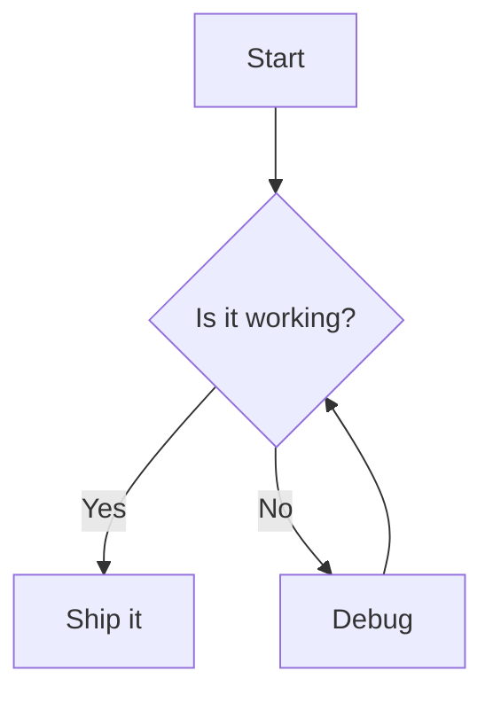
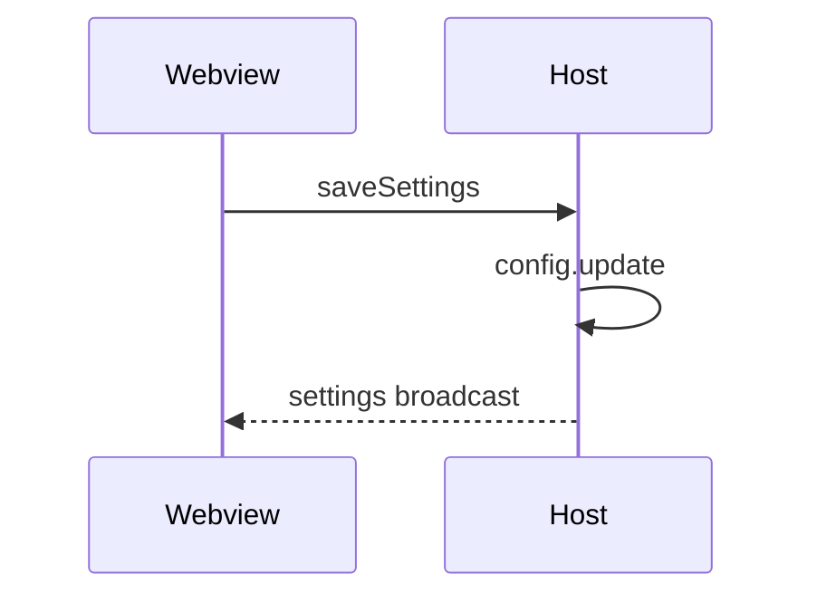
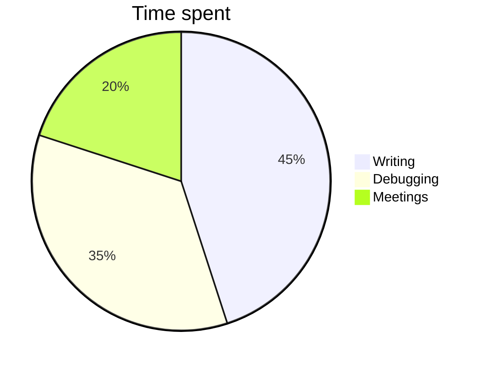

# Mermaid diagrams

Open this file in MikeDown. Each block below should render as a diagram.
Click a diagram to edit its source; click away to re-render.

## Flowchart



## Sequence



## Pie



## Invalid (should show source + inline error)

```mermaid
flowchart TD
    A --> B -->
```
